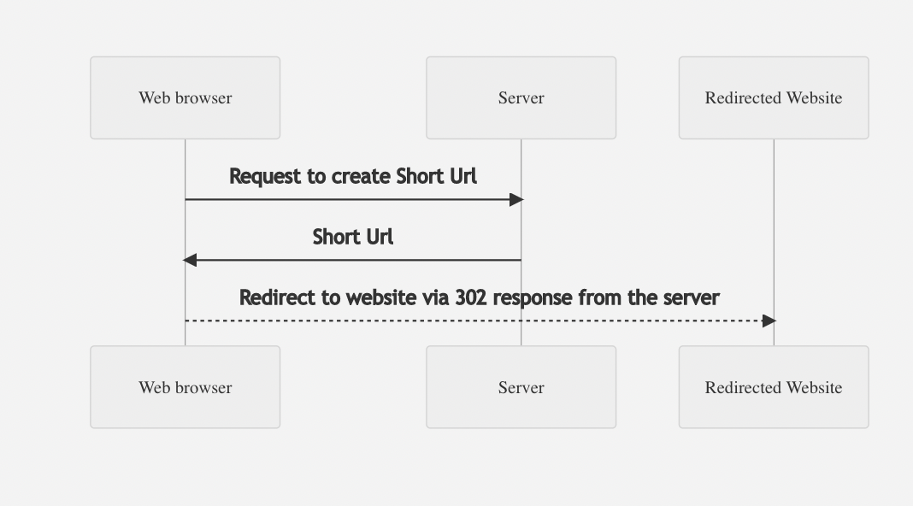

# URL Shortener

Steps to set up the application:
1. git clone https://github.com/smouli/url-shortener.git and cd into the directory
2. docker compose build
3. docker compose up
4. navigate to http://localhost:5000 on the Google Chrome browser
5. Enter the url for shortening. The expiry time is optional and does not need to be entered. 
6. The short url link will be displayed below.
7. The Analytics and Delete pages can be accessed from the home page. 
8. Tests can be run on the container using ``python -m unittest tests/testmodel.py`` . To access the docker cli, this can be done in the docker desktop by navigating to the url-shortener-web-1 container inside url-shortener application in the dashboard. 

# Architecture

The url shortener uses Redis to persist the data. This will allow for multiple nodes to run the flask server. The Short Url is generated by creating a random integer and Base62 encoding it. When the Short Url is entered into the browser, it is decoded back to the integer and the analytics are logged. A redirect request will then be returned to the browser.

## Things to improve upon

- Due to the time constraint, I could not mock the Redis client for tests. This limited the scope of my testing but will make more improvements to it. 
- Added more features in analytics such as being able to view all created Short-Urls in one page. 
- Added Ajax to the html, which will allow the user to easily navigate to the analytics and delete pages. 
- Delete expired short links through a background process

## Mermaid diagram

This is the basic flow. The server persists info from each request in Redis. 
